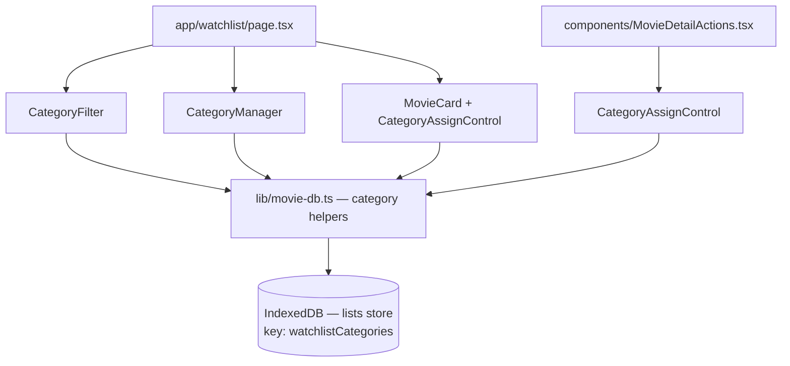

# Design Document: Watchlist Categories

## Overview

This feature adds a category/label system to the MovieBuff watchlist. Users can create named categories (e.g. "Action", "Date Night", "Watch Soon"), assign watchlisted movies to one or more categories, and filter the watchlist view by category. All data is stored client-side in IndexedDB using the existing `lists` object store, consistent with how `watchlistMovies` and `seenMovies` are already persisted.

The design is intentionally additive — no existing stores, components, or APIs are modified in a breaking way. New functions are added to `lib/movie-db.ts`, a new `WatchlistCategory` type is added to `lib/types.ts`, and new UI components are introduced alongside the existing watchlist page.

---

## Architecture



Data flows in one direction: UI components call category helper functions in `lib/movie-db.ts`, which read/write the `"watchlistCategories"` key in the `lists` IDB object store. The watchlist page holds category state in React state and re-renders when categories or assignments change.

---

## Components and Interfaces

### New Components

**`components/CategoryManager.tsx`**
Renders the create/rename/delete UI for categories. Displays all existing categories with their movie counts. Inline validation for name length (1–50 chars) and uniqueness (case-insensitive).

Props:
```ts
interface CategoryManagerProps {
  categories: WatchlistCategory[];
  onCategoriesChange: () => void; // triggers re-fetch from IDB
}
```

**`components/CategoryFilter.tsx`**
Renders the filter bar on the watchlist page. Options: "All", "Uncategorized", and each named category with its count.

Props:
```ts
interface CategoryFilterProps {
  categories: WatchlistCategory[];
  selected: string | null; // null = "All", "__uncategorized__" = Uncategorized, else category id
  onSelect: (id: string | null) => void;
  totalCount: number;
}
```

**`components/CategoryAssignControl.tsx`**
A popover/dropdown that shows all categories with checkboxes. Used both on the watchlist page (per MovieCard) and in MovieDetailActions. When no categories exist, shows a prompt to create one first.

Props:
```ts
interface CategoryAssignControlProps {
  imdbID: string;
  categories: WatchlistCategory[];
  onAssignmentChange: () => void;
}
```

### Modified Components

**`app/watchlist/page.tsx`**
- Loads categories from IDB on mount alongside watchlist movies
- Holds `categories`, `selectedFilter` state
- Renders `CategoryManager`, `CategoryFilter`, and passes categories down to each `MovieCard` area
- On movie removal, calls `removeMovieFromAllCategories(imdbID)` before updating watchlist
- When selected category is deleted, resets filter to "All"

**`components/MovieDetailActions.tsx`**
- Conditionally renders `CategoryAssignControl` when `isInWatchlist === true`
- Loads categories from IDB when the movie is in the watchlist

---

## Data Models

### New type in `lib/types.ts`

```ts
export interface WatchlistCategory {
  id: string;        // nanoid or crypto.randomUUID()
  name: string;      // 1–50 characters, unique case-insensitively
  movieIds: string[]; // imdbIDs of assigned watchlist movies
}
```

### IDB Storage

Stored under the existing `lists` object store with key `"watchlistCategories"`:

```ts
// IDB value at key "watchlistCategories"
WatchlistCategory[]
```

Default value when key is absent: `[]`

No IDB schema version bump is required — the `lists` store already exists at DB version 2.

### New functions in `lib/movie-db.ts`

```ts
// Read all categories
getCategories(): Promise<WatchlistCategory[]>

// Persist the full categories array atomically
setCategories(categories: WatchlistCategory[]): Promise<void>

// Create a new category (generates id, validates name externally)
createCategory(name: string): Promise<WatchlistCategory>

// Rename an existing category by id
renameCategory(id: string, newName: string): Promise<void>

// Delete a category by id (does not affect watchlist movies)
deleteCategory(id: string): Promise<void>

// Assign a movie to a category (idempotent)
assignMovieToCategory(imdbID: string, categoryId: string): Promise<void>

// Unassign a movie from a category
unassignMovieFromCategory(imdbID: string, categoryId: string): Promise<void>

// Remove a movie from all categories (called on watchlist removal)
removeMovieFromAllCategories(imdbID: string): Promise<void>
```

All write operations read the current array, mutate it, and write it back in a single `setCategories` call to ensure atomicity within the single-threaded browser JS environment.

---

## Correctness Properties

*A property is a characteristic or behavior that should hold true across all valid executions of a system — essentially, a formal statement about what the system should do. Properties serve as the bridge between human-readable specifications and machine-verifiable correctness guarantees.*

### Property 1: Category persistence round-trip

*For any* array of `WatchlistCategory` objects written via `setCategories`, calling `getCategories` immediately after should return a structurally equivalent array.

**Validates: Requirements 1.1, 1.2, 1.4**

---

### Property 2: Default empty categories

*For any* fresh IDB state where `"watchlistCategories"` has never been written, `getCategories` should return an empty array.

**Validates: Requirements 1.4**

---

### Property 3: Movie removal cleans all categories

*For any* set of categories where a given `imdbID` appears in one or more `movieIds` arrays, calling `removeMovieFromAllCategories(imdbID)` should result in no category containing that `imdbID`.

**Validates: Requirements 1.5**

---

### Property 4: Category name uniqueness

*For any* existing set of categories, attempting to create or rename a category to a name that matches an existing category name (case-insensitively) should be rejected and leave the category list unchanged.

**Validates: Requirements 2.2, 2.3, 2.4**

---

### Property 5: Category name length validation

*For any* string that is empty or longer than 50 characters, attempting to create or rename a category with that string should be rejected and leave the category list unchanged.

**Validates: Requirements 2.1, 2.2, 2.4**

---

### Property 6: Delete does not remove watchlist movies

*For any* category containing a non-empty `movieIds` array, deleting that category should leave the `"watchlistMovies"` list in IDB unchanged.

**Validates: Requirements 2.5, 2.6**

---

### Property 7: Assign is idempotent

*For any* category and `imdbID`, assigning the same movie to the same category multiple times should result in the `imdbID` appearing exactly once in that category's `movieIds`.

**Validates: Requirements 3.2**

---

### Property 8: Unassign removes movie from category

*For any* category that contains a given `imdbID`, calling `unassignMovieFromCategory` should result in that `imdbID` no longer appearing in the category's `movieIds`.

**Validates: Requirements 3.3**

---

### Property 9: Filter correctness

*For any* selected category filter and watchlist, the set of displayed movies should be exactly the intersection of the watchlist and the selected category's `movieIds` — no more, no less.

**Validates: Requirements 4.2**

---

### Property 10: Uncategorized filter correctness

*For any* watchlist and set of categories, selecting "Uncategorized" should display exactly the movies whose `imdbID` does not appear in any category's `movieIds`.

**Validates: Requirements 6.1, 6.2**

---

### Property 11: Category movie count accuracy

*For any* category, the count displayed in the UI should equal the size of the intersection between the category's `movieIds` and the current `"watchlistMovies"` list (a movie removed from the watchlist should not inflate the count).

**Validates: Requirements 2.7**

---

## Error Handling

| Scenario | Handling |
|---|---|
| IDB unavailable (private browsing, storage quota) | `getCategories` returns `[]`; write operations surface an error toast |
| Category name empty or > 50 chars | Inline validation error, no IDB write |
| Duplicate category name (case-insensitive) | Inline validation error, no IDB write |
| Rename/delete a category id that no longer exists | No-op (stale state); UI re-fetches categories |
| Movie assigned to a deleted category | `removeMovieFromAllCategories` is defensive — iterates all categories, safe if category is already gone |
| Filter active when category is deleted | Watchlist page detects missing category id in updated list, resets filter to "All" |

---

## Testing Strategy

### Unit Tests

Focus on the pure logic functions and validation:

- `createCategory` rejects empty names, names > 50 chars, and duplicate names
- `deleteCategory` removes the category but leaves `watchlistMovies` intact
- `assignMovieToCategory` is idempotent (no duplicate `imdbID` entries)
- `unassignMovieFromCategory` removes the correct entry
- `removeMovieFromAllCategories` clears the `imdbID` from every category
- Filter logic: given a movie list and a selected category, the correct subset is returned
- Uncategorized filter: movies with no category assignments are correctly identified

### Property-Based Tests

Use **fast-check** (TypeScript-native, works in Vitest/Jest) for property tests. Each test should run a minimum of 100 iterations.

```
// Tag format: Feature: watchlist-categories, Property N: <property text>
```

- **Property 1** — `fc.array(arbitraryCategory)` → write then read → deep equal
- **Property 2** — fresh IDB mock → `getCategories()` → `[]`
- **Property 3** — `fc.array(arbitraryCategory, { minLength: 1 })` with random `imdbID` seeded into some categories → `removeMovieFromAllCategories` → no category contains that id
- **Property 4** — `fc.array(arbitraryCategory)` + `fc.string()` → create/rename with existing name (any casing) → rejected, list unchanged
- **Property 5** — `fc.oneof(fc.constant(''), fc.string({ minLength: 51 }))` → create/rename → rejected
- **Property 6** — `fc.array(arbitraryCategory)` with non-empty `movieIds` → delete → watchlist list unchanged
- **Property 7** — `fc.record({ categoryId: fc.uuid(), imdbID: fc.string() })` → assign twice → `movieIds` contains exactly one entry
- **Property 8** — assign then unassign → `movieIds` does not contain `imdbID`
- **Property 9** — `fc.array(arbitraryMovie)` + `fc.record(arbitraryCategory)` → filter → result equals intersection
- **Property 10** — `fc.array(arbitraryMovie)` + `fc.array(arbitraryCategory)` → uncategorized filter → result equals movies not in any category
- **Property 11** — `fc.array(arbitraryCategory)` + `fc.array(fc.string())` as watchlist → count equals `movieIds ∩ watchlist`

Each property test must include a comment referencing the design property it validates, e.g.:
```ts
// Feature: watchlist-categories, Property 3: Movie removal cleans all categories
```
